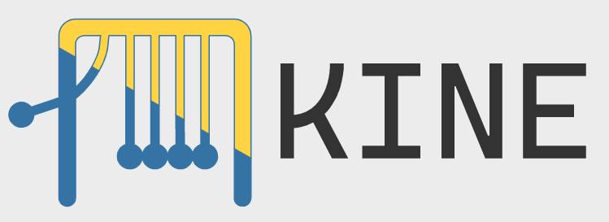

# Kine



A react style GUI framework in python.


### Example

```py
import asyncio

from kine import *
from kine.renderers.web import *

@component
def app(cx: Scope):
    value = use_state(cx, lambda: 0)

    return cx.render(div()[
        button(
            onclick=lambda _: value.modify(lambda v: v - 1)
        )[
            "Minus"
        ],
        f"{value.get()}",
        button(
            onclick=lambda _: value.modify(lambda v: v + 1)
        )[
            "Add"
        ],
    ])

asyncio.run(web.start(app()))
```
